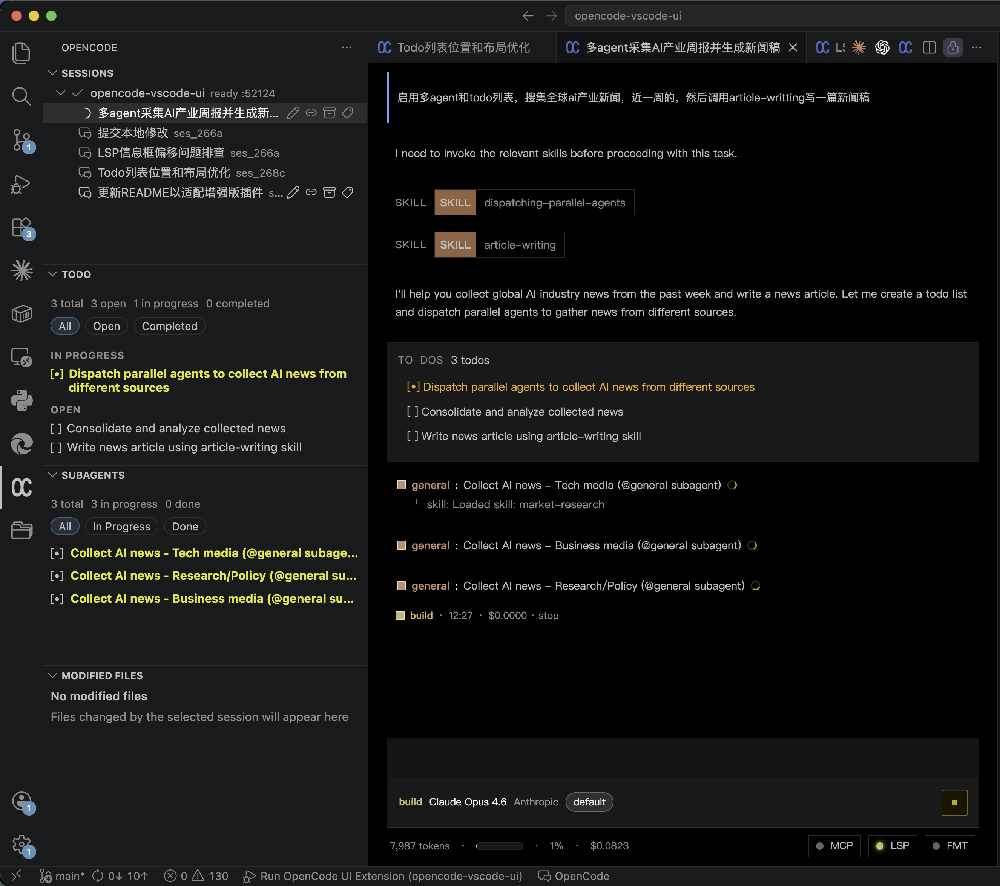
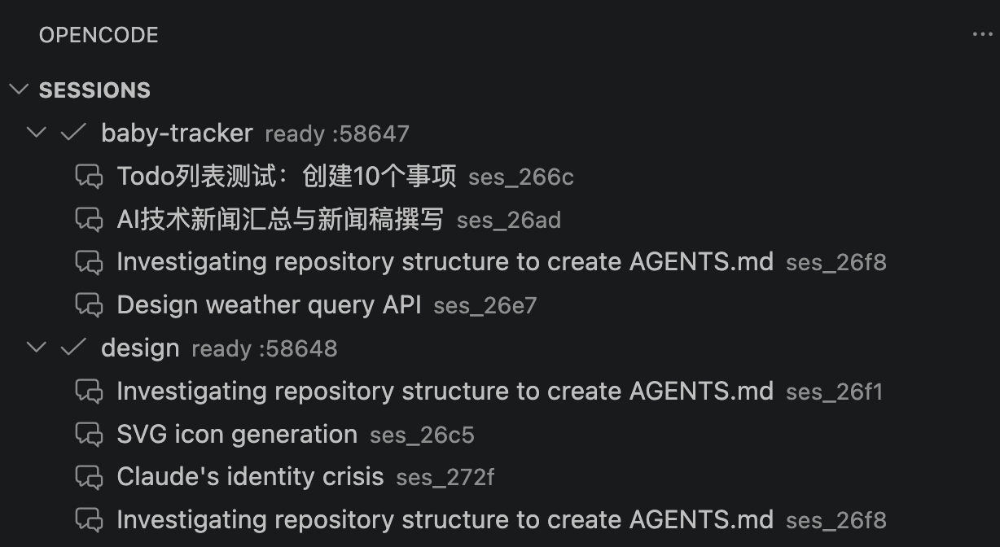
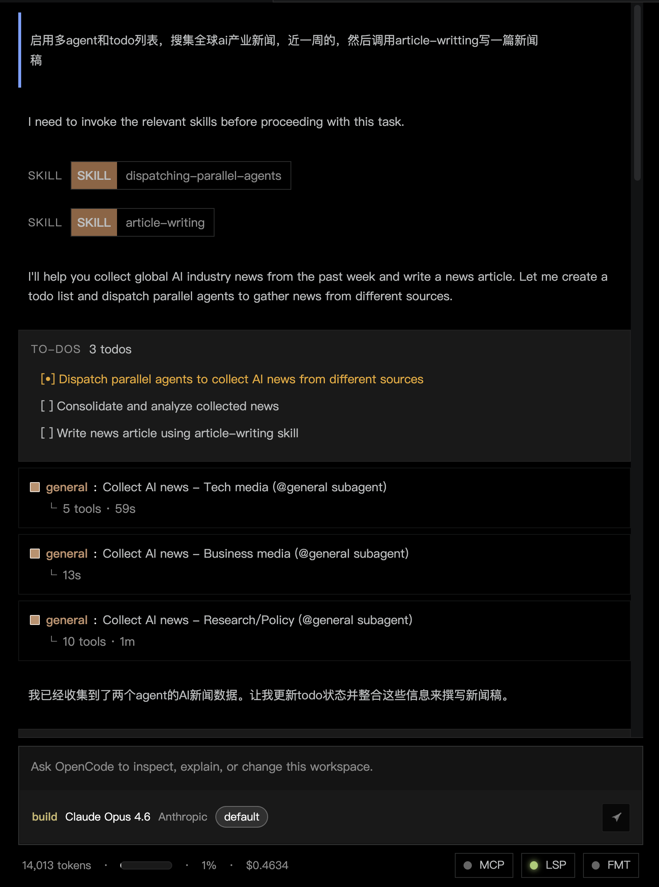
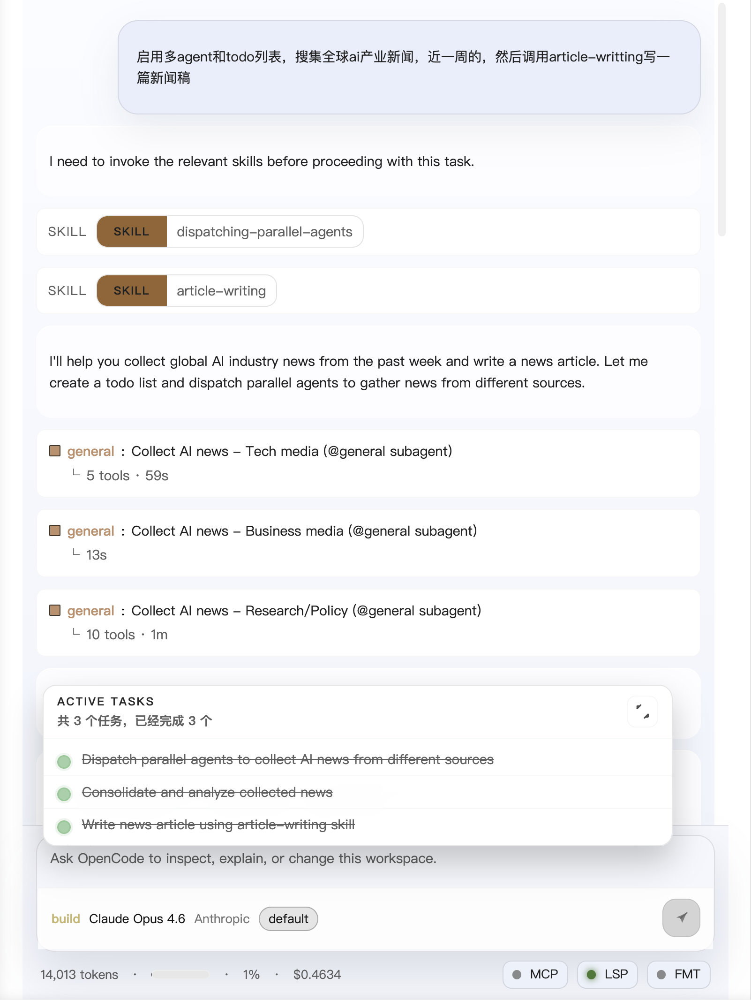
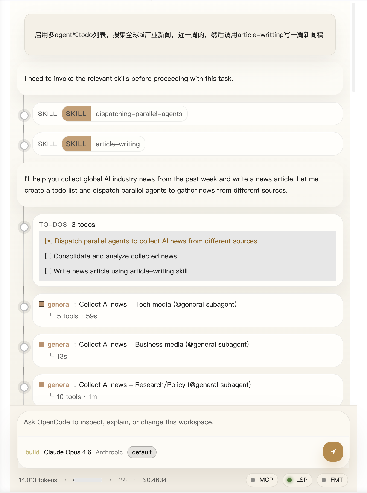
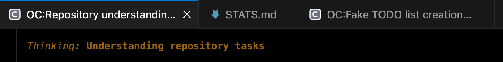
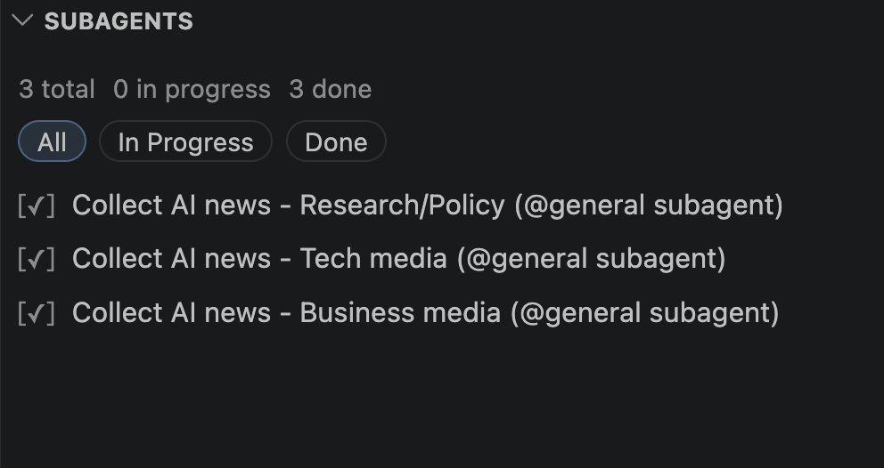
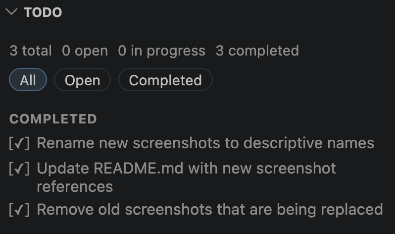
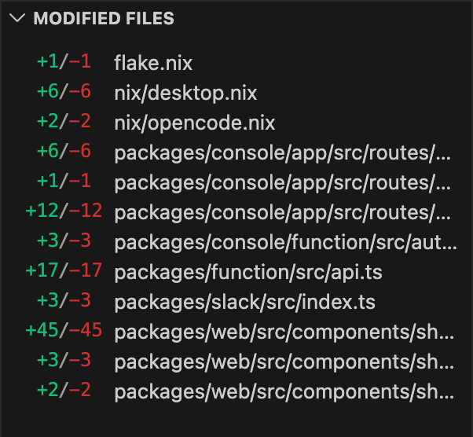
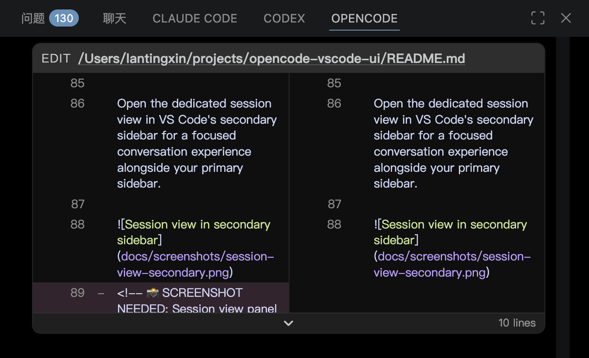

# OpenCode Enhanced UI

**An enhanced VS Code extension that brings OpenCode sessions into your editor with powerful organization, visual customization, and workflow tools.**

> **Built for productive AI-assisted development:** browse sessions with a **workspace-aware sidebar**, customize your **panel themes**, track **subagents and todos**, organize with **tags and search**, and keep everything visible while you code—whether you work locally or over **Remote SSH**.

Stay in the editor, keep context intact, and manage OpenCode where the code already lives.

## ✨ What's Enhanced

This enhanced version extends the original OpenCode UI with:

- **🎨 Panel Theme System** - Choose from multiple visual presets (default, codex, claude) with automatic light/dark mode support
- **🤖 Subagents Companion View** - Track and monitor subagent sessions in a dedicated sidebar panel
- **🏷️ Session Tagging & Filtering** - Organize sessions with custom tags and filter by tag directly in the sidebar
- **🔍 Session Search** - Quickly find sessions within each workspace with built-in search
- **📋 Enhanced Todo View** - Task tracking with grouped sections and better organization
- **📊 Modified Files Tracking** - See exactly which files changed during each session
- **💬 Compact Skill Rendering** - Cleaner, more readable skill invocation display
- **🎯 Context Menu Actions** - Right-click to ask about selections, files, or explorer items
- **🔗 Session Sharing** - Share and unshare sessions with team members
- **🌐 HTTP Proxy Support** - Configure proxy settings for opencode serve

## Why use it 🚀

- **Browse sessions by workspace folder** from the Activity Bar
- **Search and filter sessions** within each workspace using tags or text search
- **Customize your visual experience** with three panel theme presets
- **Track subagents in real-time** with the dedicated subagents companion view
- **Monitor tasks and file changes** with enhanced todo and diff views
- **Open every conversation in its own VS Code tab** with persistent state
- **Quick context actions** from editor selections and file explorer
- **Use it in local folders and Remote SSH workspaces** seamlessly
- **Catch missing `opencode` setup early** with built-in environment checks

## Visual tour 👀

### Sessions sidebar with search and tags

The sidebar gives you a workspace-first view of your OpenCode sessions. Create, reopen, refresh, tag, filter, and search conversations without leaving VS Code.

Search sessions within one workspace at a time, or filter by tags to organize your active work.

### Panel theme system

Choose from three visual presets to match your workflow preference. All themes automatically adapt to VS Code's light or dark mode.

| Default Theme | Codex Theme | Claude Theme |
| --- | --- | --- |
|  |  |  |
| Standard OpenCode styling | Tool-like preset with stronger framing | Softer preset with gentler surfaces |

### Dedicated conversation tabs

Each session opens in its own tab, making it easier to keep multiple threads organized while you continue editing code in the same window.

### Subagents companion view

Track subagent sessions spawned by the focused session in a dedicated sidebar panel. Monitor their status and navigate between parent and child sessions effortlessly.

### Enhanced todo and modified files views

Companion views help you triage focused-session tasks with grouped sections and filters, and inspect which files changed during the conversation.

| Enhanced Todo View | Modified Files Tracking |
| --- | --- |
|  |  |

### Compact skill invocations

Skill usage is rendered as clean, compact markers that don't clutter your transcript while still providing full visibility into what skills are being used.

### Session view in secondary sidebar

Open the dedicated session view in VS Code's secondary sidebar for a focused conversation experience alongside your primary sidebar.

## Key Features 🎯

### Organization & Discovery
- One OpenCode runtime per workspace folder
- Session browser with create, open, refresh, rename, and archive actions
- Workspace-scoped session search from the sidebar
- Local session tagging with tag-based filtering
- A dedicated panel for each workspace-session pair

### Visual Customization
- Three panel theme presets: default, codex, and claude
- Automatic light/dark mode adaptation
- Configurable diff rendering (unified or split view)
- Optional thinking block visibility
- Compact skill invocation rendering

### Workflow Tools
- Subagents companion view for tracking child sessions
- Enhanced todo view with grouped sections
- Modified files tracking scoped to active session
- Context menu actions for selections and files
- Session sharing and collaboration support

### Developer Experience
- Built-in environment checks with clear setup feedback
- HTTP proxy configuration support
- Status bar integration for quick access
- Persistent panel state across restarts

## Remote SSH ready 🌐

OpenCode Enhanced UI runs on the correct extension host, so Remote SSH sessions stay aligned with the active workspace.

- Runs against the remote machine when you use Remote SSH
- Preserves workspace identity across local and remote folders
- Keeps file opening and panel restore behavior aligned with the active workspace
- All enhanced features work seamlessly over SSH

## Requirements

- **VS Code `1.94.0` or newer**
- **`opencode` installed on the active extension host and available on `PATH`**

If you use Remote SSH, **install `opencode` on the remote host** so the extension can launch `opencode serve` there.

## Quick start ⚡

1. Open a project folder in VS Code.
2. Confirm `opencode` is available in that environment.
3. Open the OpenCode view from the Activity Bar.
4. Run `OpenCode: Check Environment` if you want to verify setup first.
5. Create a new session or reopen one from the sidebar.
6. Right-click an editor selection or current file to open OpenCode with prefilled context.
7. Right-click selected files in the Explorer to seed a new session with multiple file refs.
8. Use the always-visible OpenCode status bar entry to reopen the active session or start a quick session from the current editor.
9. Customize your experience in settings: choose a panel theme, configure diff rendering, and adjust visibility options.

## Commands

### Session Management
- `OpenCode: New Session` - Create a new session in the current workspace
- `OpenCode: Quick New Session` - Quickly start a session from the current editor
- `OpenCode: Open Session` - Open an existing session
- `OpenCode: Rename Session` - Rename the selected session
- `OpenCode: Archive Session` - Archive a session to clean up your sidebar
- `OpenCode: Share Session` - Generate a shareable link for the session
- `OpenCode: Unshare Session` - Revoke sharing for a session

### Organization
- `OpenCode: Search Sessions` - Search sessions within a workspace
- `OpenCode: Clear Session Search` - Clear the active search filter
- `OpenCode: Manage Session Tags` - Add or remove tags from a session
- `OpenCode: Filter Sessions By Tag` - Filter sessions by tag in a workspace
- `OpenCode: Clear Session Tag Filter` - Clear the active tag filter

### Context Actions
- `OpenCode: Ask About Selection` - Open OpenCode with the current selection
- `OpenCode: Ask About Current File` - Open OpenCode with the current file
- `OpenCode: Ask About Selected Files` - Open OpenCode with selected Explorer files

### Workspace & Environment
- `OpenCode: Refresh` - Refresh all workspace sessions
- `OpenCode: Refresh Workspace Sessions` - Refresh sessions for a specific workspace
- `OpenCode: Restart Workspace Server` - Restart the opencode serve process
- `OpenCode: Check Environment` - Verify opencode installation and setup
- `OpenCode: Open Output` - Open the OpenCode output channel
- `OpenCode: Open Settings` - Open OpenCode settings

## Configuration

Access settings via `OpenCode: Open Settings` or search for "OpenCode" in VS Code settings.

### Visual Settings
- **Panel Theme** (`opencode-ui.panelTheme`) - Choose from `default`, `codex`, or `claude` presets
- **Show Thinking** (`opencode-ui.showThinking`) - Toggle visibility of thinking blocks
- **Show Internals** (`opencode-ui.showInternals`) - Toggle visibility of internal transcript blocks
- **Diff Mode** (`opencode-ui.diffMode`) - Choose `unified` or `split` diff rendering
- **Compact Skill Invocations** (`opencode-ui.compactSkillInvocations`) - Render skills as compact markers

### Network Settings
- **HTTP Proxy** (`opencode-ui.httpProxy`) - Configure HTTP proxy for opencode serve (requires restart)

## Tips & Tricks 💡

- **Use tags to organize sessions** - Right-click any session and choose "Manage Session Tags" to add custom tags, then filter by tag to focus on specific work
- **Try different panel themes** - Switch between default, codex, and claude themes to find your preferred visual style
- **Monitor subagents** - Keep the Subagents view open to track child sessions spawned during complex tasks
- **Quick context actions** - Select code and right-click to instantly ask OpenCode about it
- **Search within workspaces** - Use the search icon on workspace rows to quickly find sessions without affecting other workspaces
- **Use the status bar** - Click the OpenCode status bar item for quick access to the active session

## Notes

- **Sessions are organized per workspace folder**
- **Remote SSH requires `opencode` on the remote host**
- **Environment issues can be checked** with `OpenCode: Check Environment`
- **Panel themes adapt to VS Code's light/dark mode automatically**
- **Session tags are stored locally and workspace-specific**

## Feedback 💬

Have an idea or hit a bug? Open an issue at <https://github.com/LanTingxin/opencode-enhanced/issues>.
