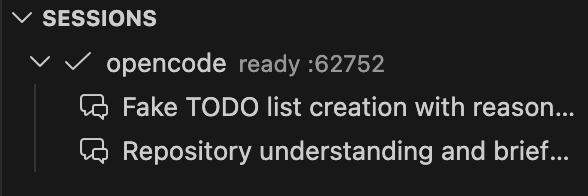

# OpenCode UI

**Bring OpenCode sessions into VS Code without leaving your workspace.**

> **Built for focused workflows:** browse sessions with a **workspace-aware sidebar**, open each conversation in **dedicated session tabs**, and keep **todos and modified files** visible while you code, whether you work locally or over **Remote SSH**.

Stay in the editor, keep context intact, and manage OpenCode where the code already lives.

## Why use it ✨

- **Browse sessions by workspace folder** from the Activity Bar
- **Search sessions within one workspace** directly from the sidebar
- **Open every conversation in its own VS Code tab**
- **Track todos and changed files beside the active session**
- **Use it in local folders and Remote SSH workspaces**
- **Catch missing `opencode` setup early** with built-in environment checks

## Visual tour 👀

### Sessions sidebar

The sidebar gives you a workspace-first view of your OpenCode sessions so you can create, reopen, refresh, and manage conversations without leaving VS Code.

You can also search sessions for one workspace at a time from the workspace row, keeping the rest of the tree unchanged while you narrow results.

### Dedicated conversation tabs

Each session opens in its own tab, making it easier to keep multiple threads organized while you continue editing code in the same window.

### Todos and changed files at a glance

Companion views help you track session-generated tasks and inspect which files changed during the conversation.

| Todo view | Modified files |
| --- | --- |
|  |  |

## Highlights 🚀

- One OpenCode runtime per workspace folder
- Session browser with create, open, refresh, and delete actions
- Workspace-scoped session search from the sidebar
- A dedicated panel for each workspace-session pair
- Todo and modified file companion views
- Built-in environment checks with clearer `opencode` setup feedback

## Remote SSH ready 🌐

OpenCode UI runs on the correct extension host, so Remote SSH sessions stay aligned with the active workspace.

- Runs against the remote machine when you use Remote SSH
- Preserves workspace identity across local and remote folders
- Keeps file opening and panel restore behavior aligned with the active workspace

## Requirements

- **VS Code `1.94.0` or newer**
- **`opencode` installed on the active extension host and available on `PATH`**

If you use Remote SSH, **install `opencode` on the remote host** so the extension can launch `opencode serve` there.

## Quick start ⚡

1. Open a project folder in VS Code.
2. Confirm `opencode` is available in that environment.
3. Open the OpenCode view from the Activity Bar.
4. Run `OpenCode: Check Environment` if you want to verify setup first.
5. Create a new session or reopen one from the sidebar.
6. Right-click an editor selection or current file to open OpenCode with prefilled context.
7. Right-click selected files in the Explorer to seed a new session with multiple file refs.
8. Use the always-visible OpenCode status bar entry to reopen the active session or start a quick session from the current editor.

## Commands

- `OpenCode: New Session`
- `OpenCode: Refresh`
- `OpenCode: Open Session`
- `OpenCode: Delete Session`
- `OpenCode: Open Output`
- `OpenCode: Check Environment`
- `OpenCode: Refresh Workspace Sessions`
- `OpenCode: Restart Workspace Server`
- `OpenCode: Ask About Selection`
- `OpenCode: Ask About Current File`
- `OpenCode: Ask About Selected Files`

## Notes

- **Sessions are organized per workspace folder**
- **Remote SSH requires `opencode` on the remote host**
- **Environment issues can be checked** with `OpenCode: Check Environment`

## Feedback 💬

Have an idea or hit a bug? Open an issue at <https://github.com/a710128/opencode-vscode-ui/issues>.
